# Flow-based Generative Model (for MNIST)

## Tricks

### Dequantization

Recall that the goal for our MNIST flow model here transform a discrete distribution (pixel value distribution) to a multivariate gaussian normal distribution. In other words, we want to model discrete distribution (e.g. categorical distribution) with our flow model here. The problem is that a discrete distribution is not well-defined in a continuous space: the pdf of it will become a function that is mostly zero but full of delta spikes with no width (Figure 1). This will cause the flow model to place infinite likelihood on those points, and the resulting model cannot be used since it tells nothing about the "true" discrete pixel value distribution.

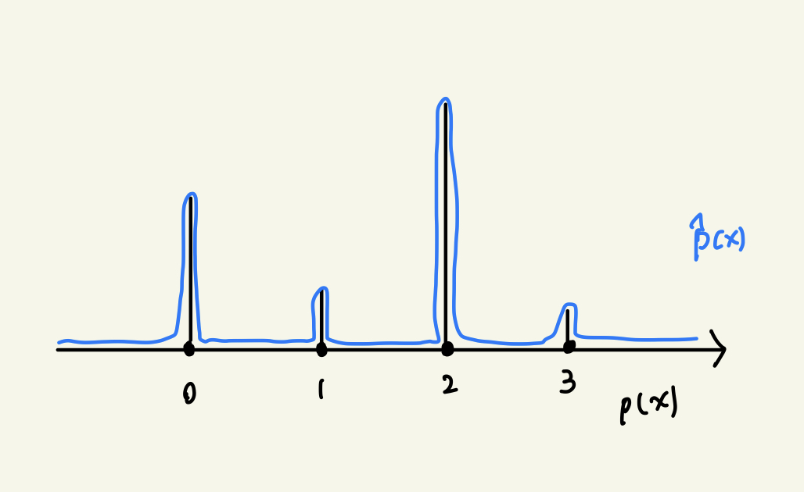

An intuitive way to fix this is to add a uniform noise to the discrete distribution, which is the "dequantize" process. The reverse process ("quantize" process, continuous -> discrete) can be a simple $floor$ function. Suppose the discrete distribution we want to model is $p(x)$, then
```math
p(x) = \int p(x+u)du = \int \frac{q(u|x)}{q(u|x)} du = \mathbb{E}\_{u\sim q(u|x)} \left[ \frac{p(x+u)}{q(u|x)} \right]
```
where $q(u|x)$ is any continuous distribution. If we add a uniform noise to fix this, then $q(u|x)=Unif(0, 1)$ and the "true" $p(x)$ we want to modify will become Figure 2. Notice that this distribution, though better than Figure 1, is still hard to model it with continuous distribution because of the discontinuity between values.

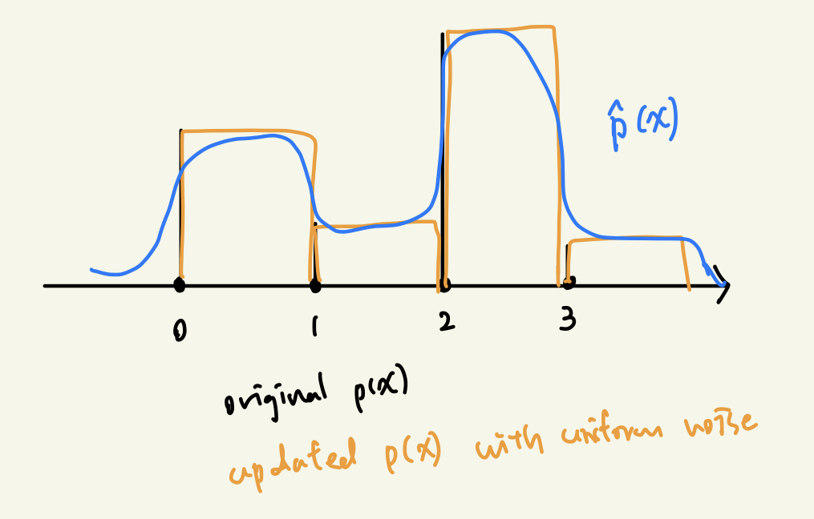

To solve this, we can make the noise $u$ depends on $x$ i.e. $u\sim q(u|x)$. An intuitive way of thinking this is: consider a categorical distribution with $p(0)=0.4, p(1)=0.1, p(2)=0.55, p(3)=0.05$. To make the distribution smooth, the "height" corresponds to each label should be similar. In order to achieve that, we should make the "width" that corresponds to label $0, 2$ larger (since it has a larger probability) and "width" that corresponds to label $1, 3$ smaller.

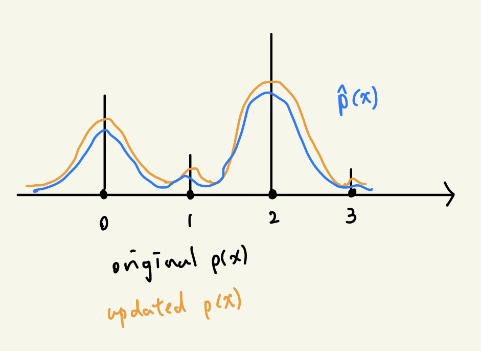

There are many ways to parameterize $q(u|x)$, such as conditional VAE or conditional Flow. We choose to use conditional Flow here.

## Analysis

Run on 12th Gen Intel(R) Core(TM) i7-12700F / NVIDIA GeForce RTX 3090

### Train Logs

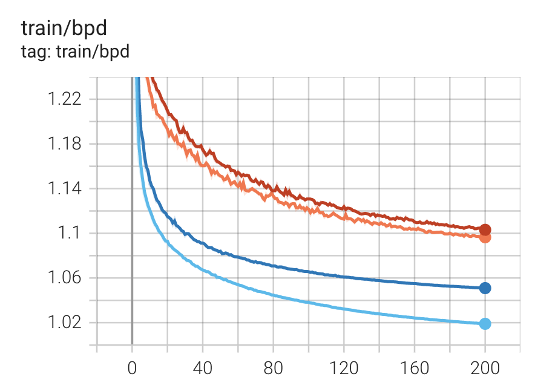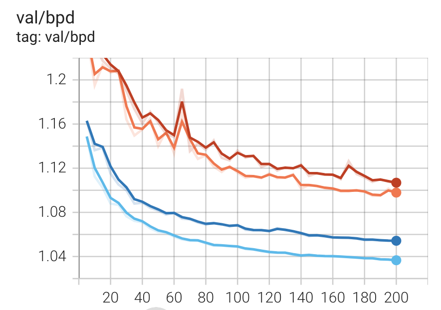

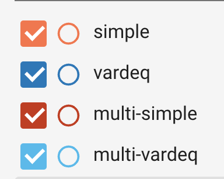

### Quantitative Result

| Model | Train Bpd | Val Bpd | Test Bpd | Inference Time (ms) | Num Params |
| - | - | - | - | - | - |
| multi-simple | 1.081993  | 1.087551 | 1.085518 | 2.6471              | 628388     |
| simple       | 1.079357  | 1.080054 | 1.078568 | 4.1067              | 556312     |
| vardeq | 1.038131 | 1.041275 | 1.039238 | 5.5446 | 1639742 |
| multi-vardeq | 1.005583 | 1.021777 | 1.020105 | 4.0657 | 1711818 |

we can see that *variation dequantization* layer helps a lot in learning. While the number of params 


### Example Images

We can see that although *-vardeq models have better bpd, the samples generated from multi-\* models are more realistic. I am not sure why multi-simple has high loss and better examples / vardeq has low loss and worse examples.

* Simple


* Vardeq

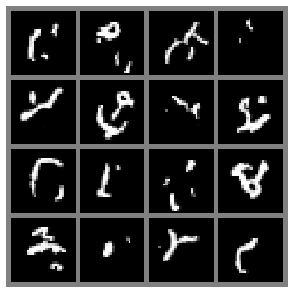

* Multi-Simple

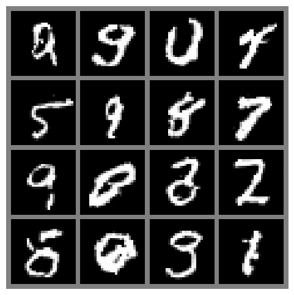

* Multi-Vardeq

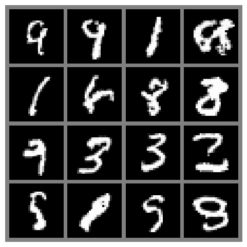

### Interpolation

The transition is more smooth in multi-* models compared to simple/vardeq.

* Simple


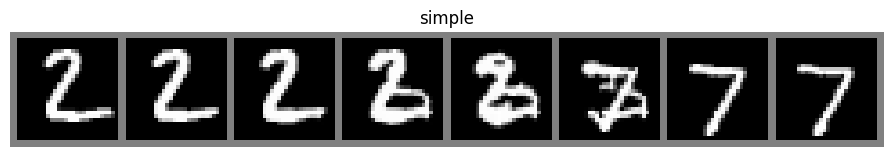

* Vardeq


* Multi-Simple

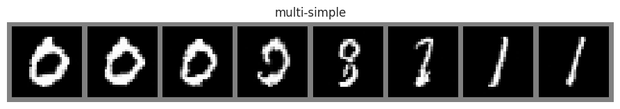

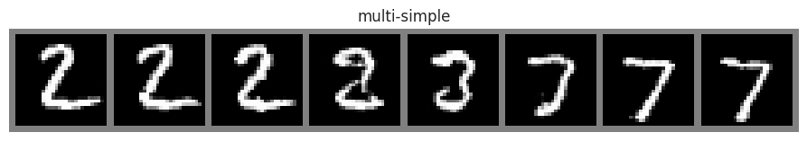

* Multi-Vardeq

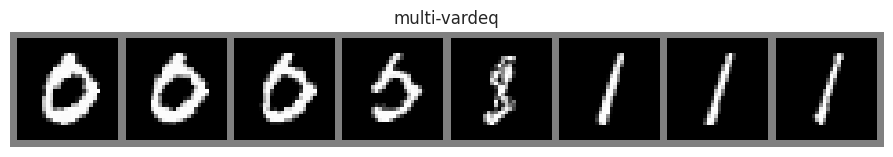


### Dequant distribution

Recall that the pixel value distribution is high skewed toward 0 (0 is black). Thus the categorical distribution will have high $P(X=0)$. This will make the underlying distribution hard to approximate, thus the discontinuous in simple / multi-simple. We can see that the distribution is much more smooth in vardeq / multi-vardeq.

* Simple

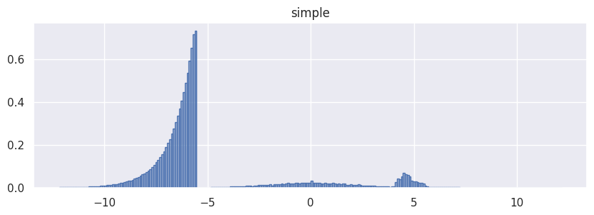

* Vardeq


* Multi-Simple


* Multi-Vardeq


